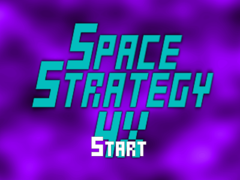
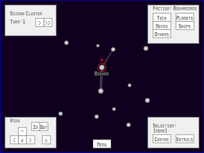
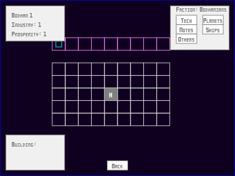
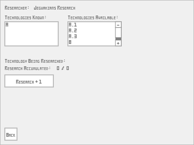

Space Strategy 4X Game
======================

The code in this repository partially implements a 4X space strategy game in TypeScript.  To see it in action, open the file SpaceStrategy4XGame.html in a web browser that runs JavaScript.

Downloading
-----------

Because the program depends on the This Could Be Better Game Framework as a submodule, it will be necessary to clone the repository recursively, perhaps by passing the "--recursive" command-line switch to Git's clone command.

Building
--------
It should not be necessary to build the program in order to run it, since the transpiled .js files are already included in the source repository.  However, if changes are made to these .ts file, the code can be recompiled by running "tsc" from within the Source directory, assuming that TypeScript has been installed and added to the path environment variable on the development machine.

Running
-------

To run locally from the filesystem, it may be necessary to run the browser with some security features disabled to allow media files to load.  Google Chrome, for example, must be run with the --allow-file-access-from-files switch.  This workaround should (hopefully) not be necessary when running the program through a web server.

